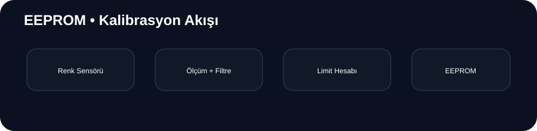

<div align="center">

# 💾 EEPROM Kod Denemeleri

**Arduino • EEPROM • Renk Sensörü • Kalibrasyon**

Kalibrasyon verilerinin ölçülmesi, filtrelenmesi ve kalıcı belleğe aktarılması üzerine hazırlanmış teknik çalışma alanı.



</div>

---

## 🎯 Amaç

Bu repository, daha büyük robotik sistemlerde kullanılabilecek **kalıcı sensör kalibrasyonu** altyapısını izole şekilde geliştirmek için kullanılır.

## 🧩 İki Temel Firmware

| Dosya | Sorumluluk |
|---|---|
| `veren/veren.ino` | Sensör ölçümü + istatistik + EEPROM yazma |
| `alan/alan.ino` | EEPROM verilerini okuma + kontrol |

## 🔬 Kalibrasyon Pipeline

```text
Sensör ölçümü → Çoklu örnek → Ortalama / sapma → Alt/üst limit → EEPROM
```

Seri port komutları: `k` = kırmızı, `m` = mavi, `y` = yeşil.

### EEPROM Haritası

| Adres | Veri |
|---:|---|
| `0` | Kırmızı alt |
| `4` | Kırmızı üst |
| `8` | Mavi alt |
| `12` | Mavi üst |
| `16` | Yeşil alt |
| `20` | Yeşil üst |
| `30` | Kalibrasyon MAGIC değeri |

> EEPROM yazma işlemleri gereksiz yere loop içinde tekrarlanmamalıdır.

## 🛠️ Teknolojiler

Arduino C/C++ · `EEPROM.h` · renk sensörü · Serial Monitor

## 🚀 Kullanım

1. `veren/veren.ino` firmware'ini yükleyin.
2. Serial Monitor'ü `9600 baud` ile açın.
3. Renk komutunu gönderin.
4. Ölçümlerin tamamlanmasını bekleyin.
5. `alan/alan.ino` ile kalibrasyonu doğrulayın.

## 📁 Yapı

```text
EEPROM-KOD-DENEMELER/
├── alan/
├── veren/
├── docs/flow.svg
└── README.md
```

## 🚧 Durum

**Deneysel / yardımcı embedded modül**
